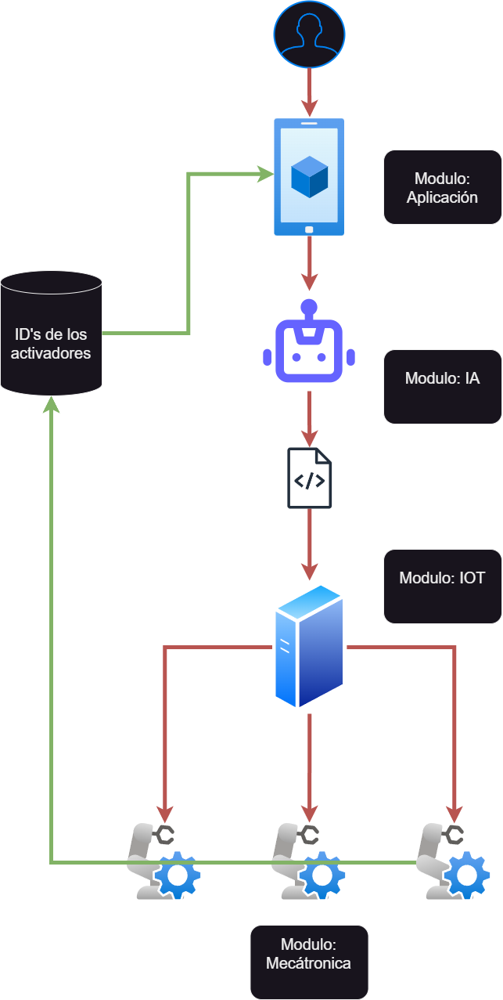

# HomeAI 🏠🤖

Bienvenido al proyecto modular que integra diferentes componentes, incluyendo aplicación, inteligencia artificial (IA), Internet de las cosas (IoT) y mecatrónica. Cada módulo tiene sus propias características y objetivos. A continuación se describen las partes del proyecto y las tareas relacionadas.

---

## Módulo Aplicación 📱
Esta parte gráfica para el usuario tendrá la funcionalidad de poder editar los nombres de los activadores, cada uno con sus respectivos ID. Además, debe tener la capacidad de grabar audios manteniendo presionada la pantalla y terminar la grabación cuando se deje de presionar. Luego, debe enviar el archivo de audio hacia la API implementada por el `Módulo AI`.

- [ ] Interfaz gráfica
- [ ] Funcionalidad para editar los nombres de los activadores
- [ ] Funcionalidad para grabar audio
- [ ] Enviar audio a través de la API

## Módulo AI 🤖
Este módulo se encargará de la implementación de la API para procesar el audio y convertirlo en texto. Luego, usará un modelo de lenguaje grande (LLM) para generar el archivo `JSON` que contendrá las instrucciones para los activadores. Finalmente, se encargará de enviar el archivo usando el `Módulo IoT`, que se encarga de la conexión entre los dispositivos y el servidor.

- [ ] Implementar la API para procesar el audio
- [ ] Diseñar el prompt
- [ ] Funcionalidad para enviar las instrucciones al servidor del `Módulo IoT`

## Módulo IoT ⚡
Este módulo debe implementar la conexión entre los dispositivos IoT y el servidor. Debe tener la funcionalidad para que, una vez reciba las instrucciones del `Módulo AI`, se ejecuten los activadores según las instrucciones.

- [ ] Configurar dispositivos IoT
- [ ] Establecer comunicación con los dispositivos
- [ ] Funcionalidad para recibir el archivo `JSON` en el servidor
- [ ] Ejecutar las instrucciones en los activadores

## Módulo Mecatrónica 🦾
Este módulo se encarga del diseño de los activadores y de la comunicación con el `Módulo IoT`.

- [ ] Diseñar los activadores
- [ ] Establecer comunicación con el servidor del `Módulo IoT`
- [ ] Realizar pruebas de funcionamiento

